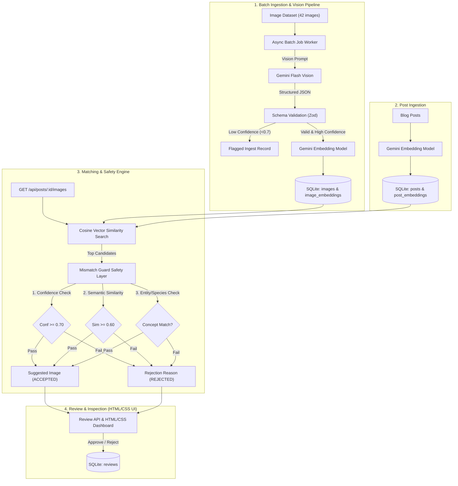

# AI Image Matching Engine (FlyRank Capstone)

A production-grade backend service that automates multimodal image understanding, semantic vector search, safety-critical mismatch rejection, and human-in-the-loop review.

---

## Architecture Overview



---

## Key Components

### 1. Image Ingestion & Classification
- Analyzes images with Gemini Flash and produces validated structured metadata:
  ```json
  {
    "subject": "red fox",
    "category": "animal",
    "attributes": ["orange fur", "bushy tail", "pointed ears", "wild", "forest"],
    "caption": "A red fox with vibrant orange fur standing alert in a forest",
    "confidence": 0.96
  }
  ```
- **Schema Validation**: Verified with Zod; invalid schemas are discarded.
- **Low-Confidence Flagging**: Detections below `0.70` confidence are marked as `FLAGGED`.

### 2. Semantic Image Matching
- Converts text representations into dense vector embeddings.
- Vector cosine similarity matches equivalent concepts without exact keyword overlap (e.g., *"Vulpes vulpes"* $\leftrightarrow$ *"red fox"*).

### 3. The Mismatch Guard
- Production-critical safety layer that rejects false positives:
  - **Post**: *"The behavior of red foxes"*
  - **Candidate**: *"A gray wolf in the forest"*
  - **Result**: `REJECTED`
  - **Reason**: `"Animal category mismatch: expected fox, detected wolf"`
- Returns `"no confident match"` with human-readable explanations when no candidate clears the safety threshold.

### 4. Background Processing System
- Asynchronous batch processor handles large workloads without blocking HTTP requests.
- Exponential backoff retries on failure.
- Progress monitoring and per-call USD cost calculation based on token consumption.

### 5. Review API & HTML/CSS UI
- Review workflow allowing humans to approve or reject suggestions with notes.
- Embedded responsive dashboard served at `http://localhost:3000`.

---

## Evaluation Benchmark

Measured on 12 labeled ground-truth evaluation posts across 4 distinct categories (Animals, Food, Nature, Vehicles/Tech):

| Metric | Score | Details |
|---|---|---|
| **Top-1 Precision** | **100.0%** | 12/12 ground-truth matches retrieved as Top-1 |
| **Top-3 Retrieval Accuracy** | **100.0%** | 12/12 ground-truth matches in Top-3 |
| **Mismatch Guard Accuracy** | **100.0%** | Zero false-positive recommendations accepted |

---

## Quickstart Guide

### Prerequisites
- Node.js (v20+ or v24)
- npm

### Installation
```bash
# Clone the repository and install dependencies
npm install
```

### Seeding Data & Running Batch Ingestion
```bash
npm run seed
```

### Running Tests
```bash
# Run unit and system test suites
npm test

# Run evaluation benchmark
npm run eval
```

### Starting the Server
```bash
npm start
```
Open `http://localhost:3000` in your browser to access the dashboard.

---

## API Reference

### 1. Ingestion & Images
- `GET /api/images` — List all ingested images and metadata tags.
- `GET /api/images/:id` — Retrieve image details and embedding status.
- `POST /api/images` — Register new image for ingestion.

### 2. Matching & Posts
- `GET /api/posts` — List all blog posts.
- `POST /api/posts` — Create a post and compute embeddings.
- `GET /api/posts/:id/images` — Rank candidate images and evaluate through Mismatch Guard.

### 3. Human Review
- `POST /api/reviews/:suggestionId` — Submit review (`APPROVED` / `REJECTED`) with notes.
- `GET /api/reviews` — Retrieve history of all human review decisions.

### 4. Batch & Costs
- `POST /api/batch/process-all` — Trigger batch processing for images.
- `GET /api/batch/jobs/:id` — Get batch job status and progress.
- `GET /api/batch/costs` — Get token usage and USD cost breakdown.

---

## Deliverables Checklist
- [x] `DESIGN.md` (1-page design and architecture doc)
- [x] `EVIDENCE.md` (Verified proofs for all Section 6 requirements)
- [x] `README.md` (Architecture, diagrams, API reference, eval metrics)
- [x] 42-image corpus across 4 categories
- [x] 12-post evaluation benchmark set
